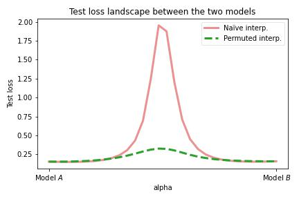
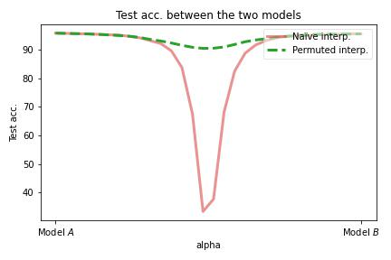
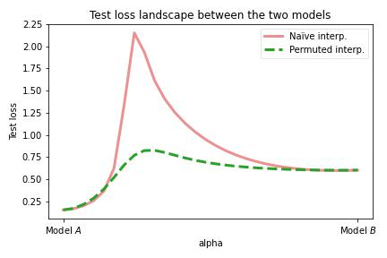
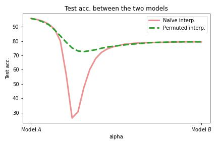

# Replicate results from Git Re-Basin, based on Jordan Keller's code

by [Thibault Castells](https://twitter.com/thibcastells) on Sept 20 2022

This code is based on [the repo from Jordan Keller](https://github.com/KellerJordan/Network-Permutations), which propose a method to merge models (similar to Git Re-Basin ([https://arxiv.org/pdf/2209.04836.pdf](https://arxiv.org/pdf/2209.04836.pdf)), but "fixed" to also work with batch norm).
I only modified the training code and added a graph plot of the loss in function of the interpolation coefficient. The model architecture and permutation method are unmodified.

## Results

#### Model A and B trained for 200 epochs

#### Model A trained for 200 epochs, model B trained for 2 epochs (model B permuted)

